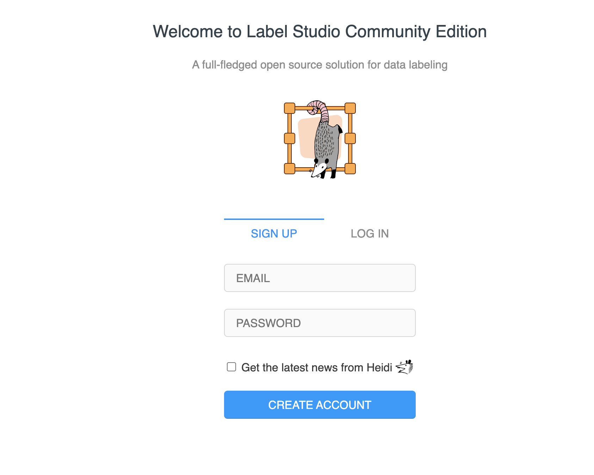
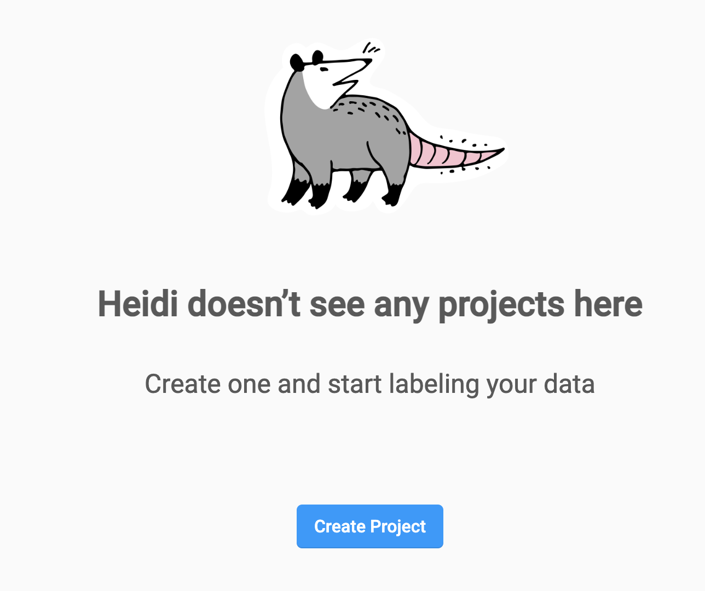
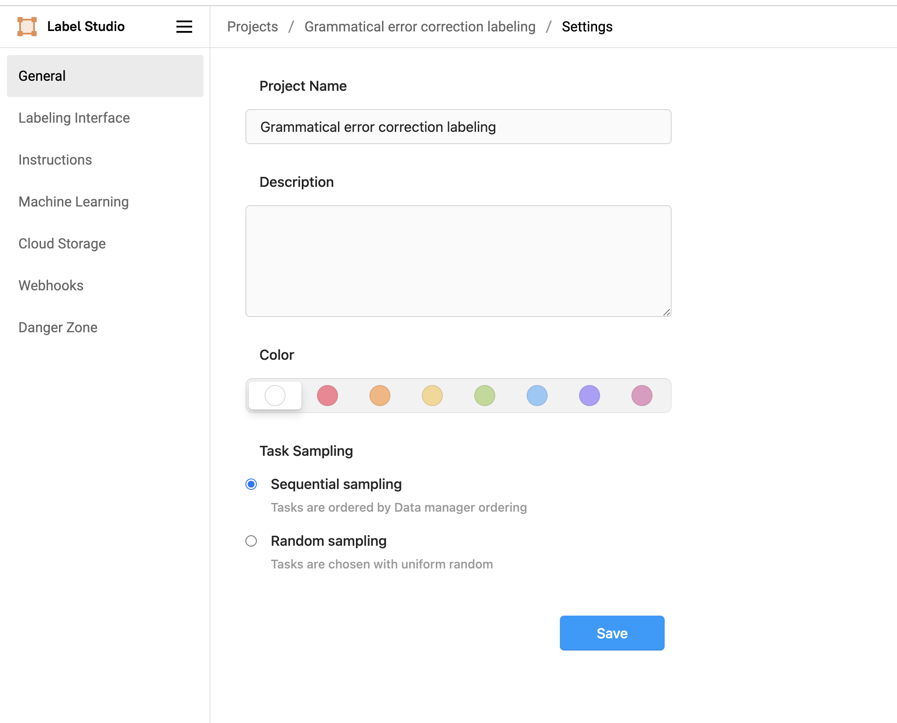
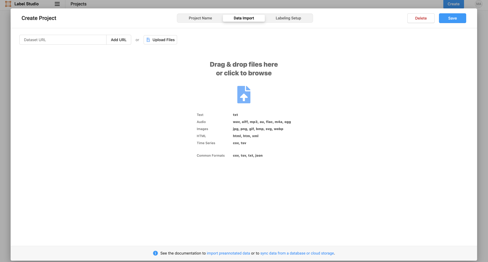
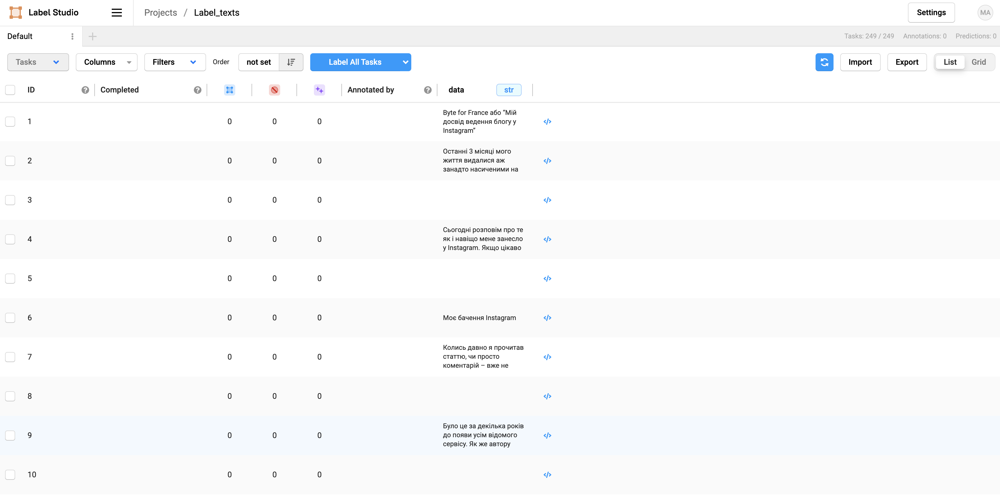
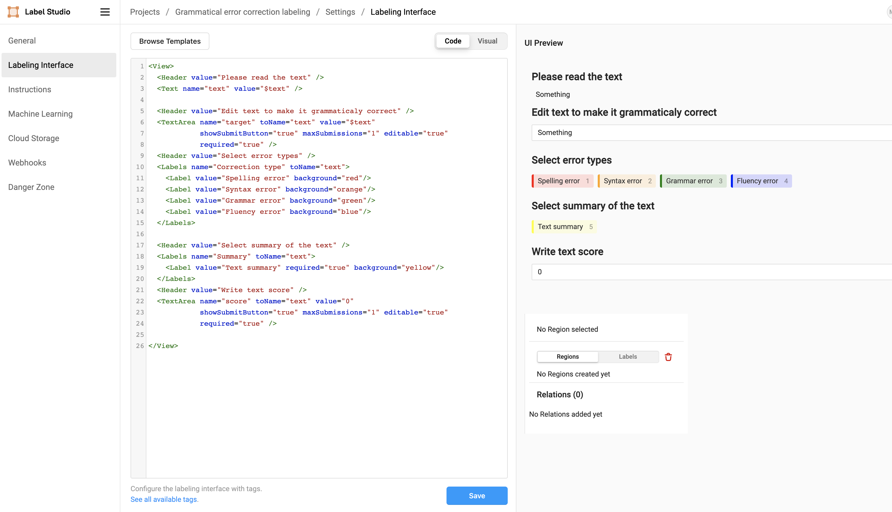
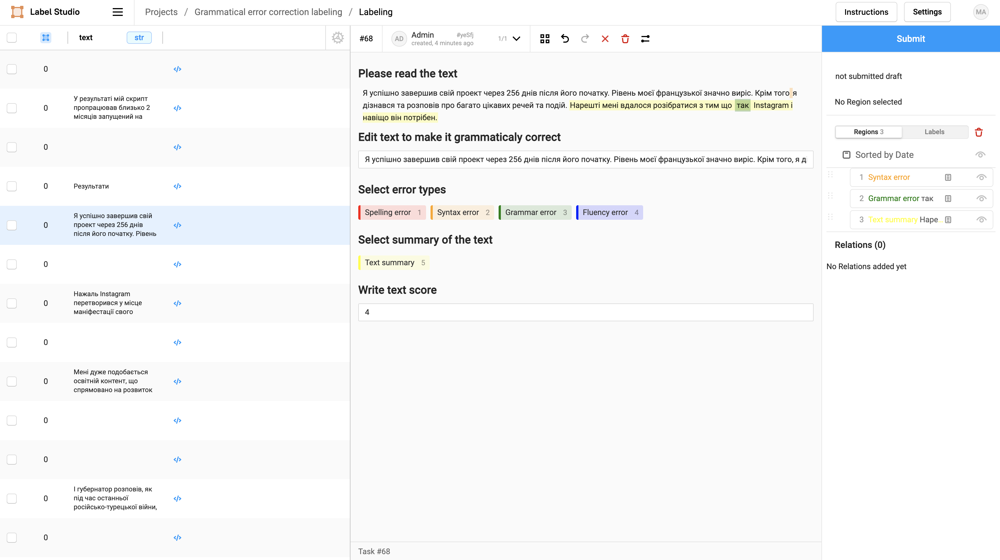
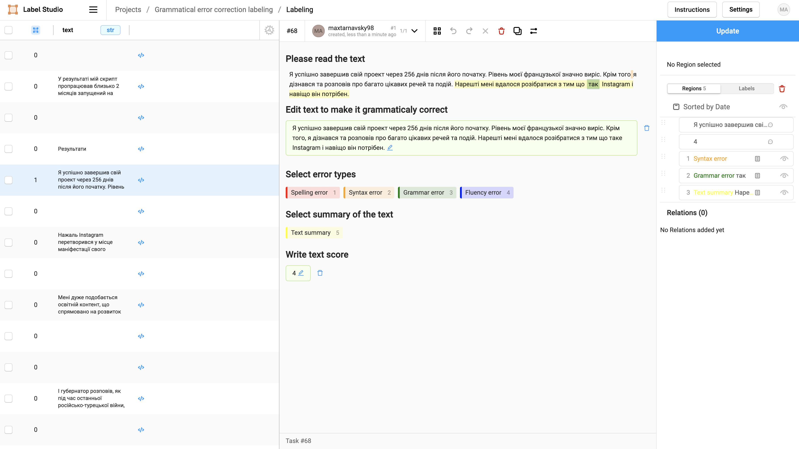
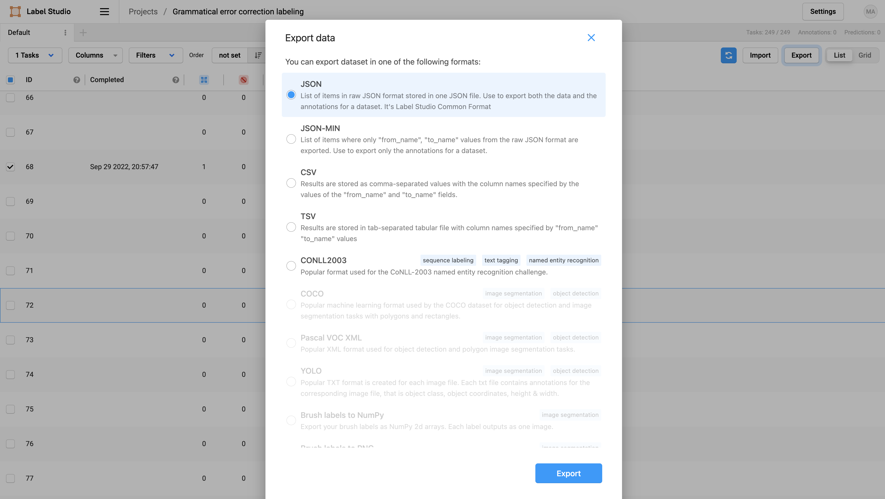
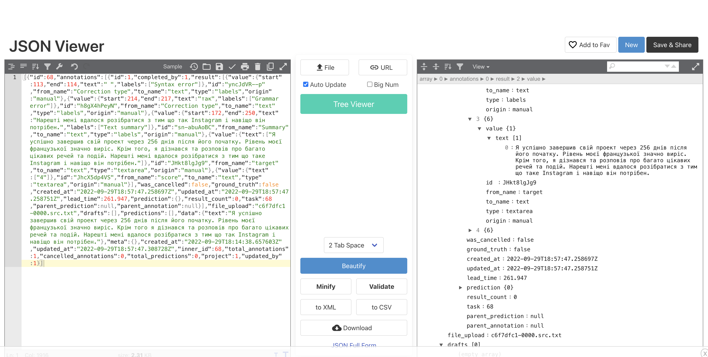

## Install label studio

```
    mkdir mydata
    docker pull heartexlabs/label-studio:latest
    docker run -it -p 8080:8080 -v mydata:/label-studio/data heartexlabs/label-studio:latest
```

## Instruction how to setup up labeling process












## Data

I decied to use data from [UA-GEC](https://github.com/grammarly/ua-gec#python-library) - Ukrainian Grammatical Error Correction dataset
