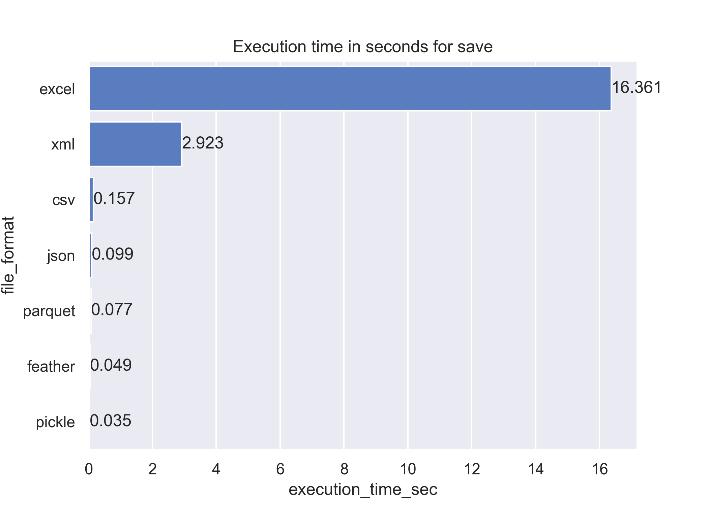
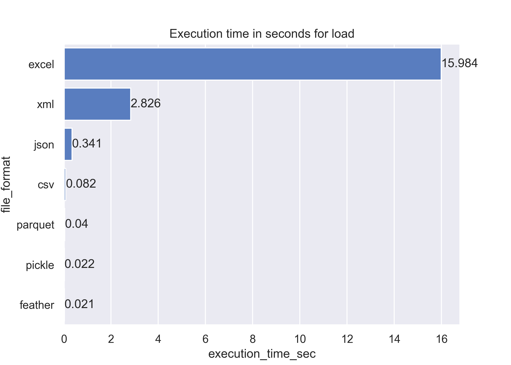
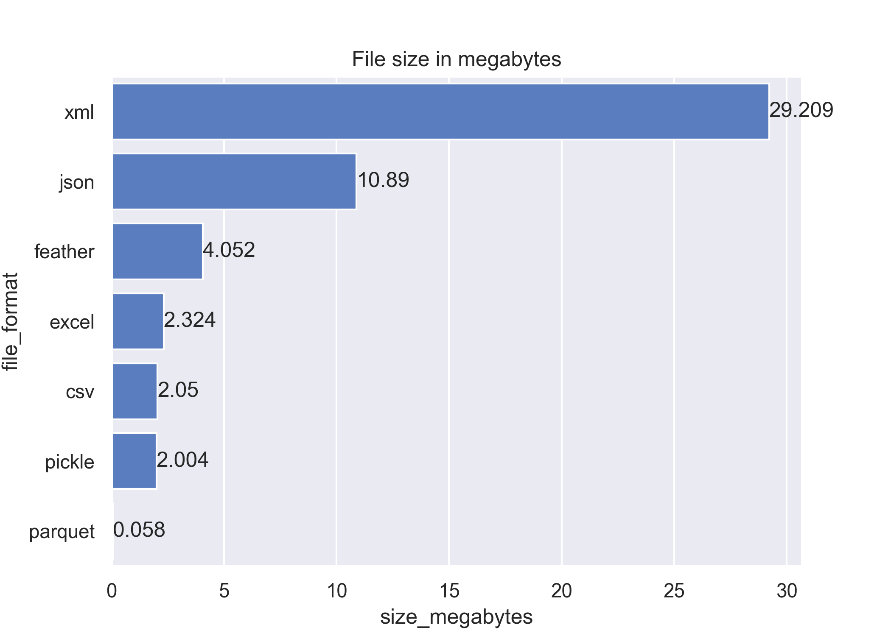

## Week-2 Data formats task

### Local setup

from root directory build docker
```
docker build -t maksymtarnavskyi/task-data-formats week2/task-data-formats
docker run -it maksymtarnavskyi/task-data-formats:latest
```
### Results






